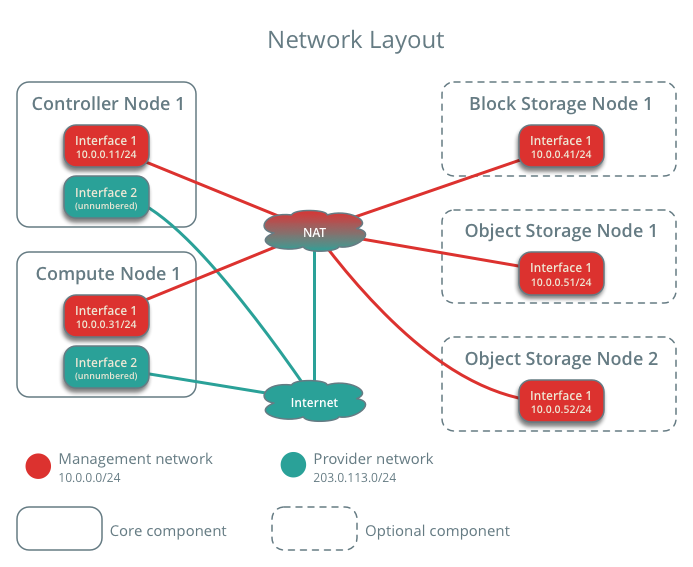
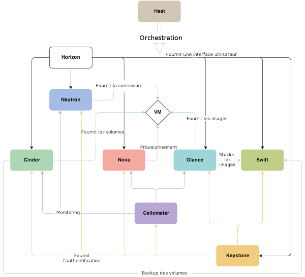

# Deploying OpenStack from Scratch: Service-by-Service Architecture

This project shows how to build an OpenStack Cloud infrastructure manually, service by service. Instead of using automatic tools (like DevStack), I installed every component step-by-step. This helped me deeply understand how Cloud architecture, Linux systems, networks, and persistent storage work together.

## 📋 Project Overview

The goal of this project is to build a working Private Cloud. By installing each OpenStack service one by one, I learned exactly how Compute, Network, Identity, and Storage components talk to each other.

### OpenStack Services Implemented:
* **Keystone (Identity):** Manages authentication, users, and the service catalog.
* **Glance (Image):** Stores and manages Virtual Machine (VM) images.
* **Placement:** Tracks available hardware resources (CPU, RAM) for the instances.
* **Nova (Compute):** Creates and manages the lifecycle of Virtual Machines.
* **Neutron (Networking):** Manages virtual networks, subnets, routers, and ports.
* **Cinder (Block Storage):** Provides persistent block storage volumes to running instances.
* **Horizon (Dashboard):** The web interface to manage the Cloud easily.
---

## 📋 Prerequisites & Deployment Standards

This project strictly follows the **Official OpenStack Installation Guide** deployment standards. The infrastructure baseline complies with the official prerequisites for a multi-node architecture:

* **Hardware & Environment:** 
  * 4 Dedicated Nodes (1 Controller, 2 Compute hosts, 1 Storage host) with nested virtualization enabled.
  * Hardware virtualization support (VT-x/AMD-V) verified on all Compute nodes.
* **Software Baseline:** 
  * Clean OS installation (Ubuntu Server) with localized package repositories configured.
  * Official OpenStack repository architecture tools (`python3-openstackclient`) installed directly from upstream.
---

## 🛠️ Technical Stack & Topology

I deployed a **4-node architecture** to simulate an enterprise-grade production environment:

* **1 Controller Node:** Runs Identity (Keystone), Image (Glance), Placement, Block Storage management (Cinder-API/Scheduler), Management APIs, MariaDB, and RabbitMQ.
* **2 Compute Nodes (Compute-01 & Compute-02):** Dedicated nodes running Nova-Compute and Hypervisors to host the Virtual Machines.
* **1 Storage Node:** Dedicated node running Cinder-Volume backend with Logical Volume Manager (LVM) and iSCSI targets.

* **Operating System:** Ubuntu Server 24.04 LTS
* **OpenStack Version:** 2025.1 (Epoxy)
* **Database:** MariaDB (To store configuration and service data)
* **Message Queue:** RabbitMQ (For communication between OpenStack services)
* **Hypervisor:** KVM/QEMU (To run the virtual machines)

---

## 🌐 Network Architecture & Topology

To achieve a true multi-node deployment, I separated the physical network interfaces into distinct logical networks using Linux bridging and Netplan configurations.

### 1. Physical Infrastructure Networks (Underlay)
*   **Management Network (`192.168.122.0/24`):** Used for internal node-to-node && node-to-internet communication, database synchronization, volume mounting, and AMQP message queues.
    *   `Controller Node IP:` 192.168.122.96
    *   `Compute Node 01 IP:` 192.168.122.68
    *   `Compute Node 02 IP:` 192.168.122.126
    *   `Storage Node IP:` 192.168.122.167
*   **Provider Network (External/Public):** Bypasses IP routing on the host to connect OpenStack instances directly to the external physical network gate.

The Netplan configuration files for all 3 nodes can be reviewed in the [OS-infrastructure configs folder](./configs/OS-infrastructure/).

### 2. Virtual Cloud Networks (Overlay - Neutron)
Once the underlying cluster network was stable, I provisioned the logical cloud infrastructure via the OpenStack CLI:

*   **External Provider Network:** A flat/VLAN network map linked to the physical interface for internet egress.
*   **Internal Private Network:** An isolated tenant network (`192.168.60.0/24`) using VXLAN encapsulation for tenant isolation.
*   **Virtual Router:** Connects the internal network to the Provider network, with SNAT enabled for internet access.
*   **Floating IP:** Allocated from the external Provider Network (`192.168.200.0/24`) to enable instances on the private internal network to access to the internet and to be accessible from external networks.
*   **Security Groups:** Configured strict firewall rules to secure instances:
    *   `Ingress:` Allowed SSH (Port 22) and ICMP (Ping) only from specific administration subnets.
    *   `Egress:` Allowed all traffic for system updates.

---

## 🏗️ How the Architecture Works

When you launch a virtual machine, the services communicate in this order:

1. **Authentication:** The user logs in and gets a security token from **Keystone**.
2. **Resource Check:** **Nova** asks **Placement** to find a hypervisor with enough free RAM and CPU.
3. **Network Creation:** **Neutron** creates a virtual port and gives an IP address to the future VM.
4. **Image Download:** **Nova** fetches the operating system image from **Glance**.
5. **Boot:** The hypervisor starts the Virtual Machine with the network and image attached.

```text
       [ PHYSICAL NETWORK / INTERNET ]
                      |
                      | (192.168.200.0/24)
                      v
         +-------------------------+
         | Router External Gateway | -> IP: 192.168.200.219
         +-------------------------+
                      |
              [ OpenStack Router ]
                      |
         +---------------------------+
         | Router Internal Interface | -> IP: 192.168.60.1
         +---------------------------+
                      |
                      | (192.168.60.0/24 isolated VXLAN)
                      v
         +---------------------------+         +-----------------------------+
         |      my-ubuntu-vm         | <====== |     Cinder Storage Node     |
         |                           |  iSCSI  |                             |
         | Fixed IP: 192.168.60.113  |         |  Persistent Volume Attached |
         | Float IP: 192.168.200.210 |         +------------------------------+
         +---------------------------+
```

---

## 📂 Configuration Files

The custom configuration profiles for each service are documented in the `configs/` directory:
* [Keystone Configuration](./configs/keystone.conf) - Identity & token setups.
* [Nova Configuration](./configs/nova-controller.conf) - Compute scheduler and controller settings.
* [Neutron Configuration](./configs/neutron.conf) - Core ML2 and overlay network bindings.
* [Cinder Configuration](./configs/cinder.conf) - Block storage and LVM target specifications.
*(Note: All sensitive passwords, tokens, and production keys have been sanitized for security.)*

---

## 📊 Infrastructure Verification

To confirm the cluster health and resource allocation, here are the outputs from the running deployment:

### Active Compute Hypervisors

```bash
$ openstack hypervisor list
+--------------------------------------+---------------------+-----------------+----------------+-------+
| ID                                   | Hypervisor Hostname | Hypervisor Type | Host IP        | State |
+--------------------------------------+---------------------+-----------------+----------------+-------+
| ea008ff7-1cb7-4dbb-ad3a-4642d4feee5c | compute2            | QEMU            | 192.168.122.96 | up    |
| 4dc300b3-4a09-4d8a-82b1-636fd281ae44 | compute1            | QEMU            | 192.168.122.96 | up    |
+--------------------------------------+---------------------+-----------------+----------------+-------+
```

### Active Block Storage Volumes
List service components to verify successful launch of each process:

```bash
$ openstack volume list
+------------------+-------------+------+---------+-------+----------------------------+
| Binary           | Host        | Zone | Status  | State | Updated At                 |
+------------------+-------------+------+---------+-------+----------------------------+
| cinder-scheduler | controller  | nova | enabled | up    | 2026-06-18T11:28:15.000000 |
| cinder-volume    | storage@lvm | nova | enabled | up    | 2026-06-18T11:28:15.000000 |
+------------------+-------------+------+---------+-------+----------------------------+
```
The active volume created and attached to an instance:

```bash
$ openstack volume list
+--------------------------------------+-------------+--------+------+---------------------------------------+
| ID                                   | Name        | Status | Size | Attached to                           |
+--------------------------------------+-------------+--------+------+---------------------------------------+
| 5d8b69e7-667f-4743-a85e-e94be8cebe74 | data-volume | in-use |   10 | Attached to my-ubuntu-vm on /dev/vdb  |
+--------------------------------------+-------------+--------+------+---------------------------------------+
```

### Active instance
The instance i have created from OpenStack CLI, automatised with [cloud-provisioning configs folder](./configs/cloud-provisioning/deploy-resources.sh).

```bash
$ openstack server list
+--------------------------------------+--------------+--------+------------------------------------------+--------------------+-----------+
| ID                                   | Name         | Status | Networks                                 | Image              | Flavor    |
+--------------------------------------+--------------+--------+------------------------------------------+--------------------+-----------+
| 358f89d7-12d2-4a93-bbf4-0c353b68243b | my-ubuntu-vm | ACTIVE | internal=192.168.200.210, 192.168.60.113 | ubuntu-24.04-cloud | m1.devops |
+--------------------------------------+--------------+--------+------------------------------------------+--------------------+-----------+
```

## 🧠 What I Learned & Troubleshooting

Installing OpenStack "the hard way" is challenging. Here are the main problems I solved:

### 1. Advanced Cloud Networking
* **Problem:** Getting internal VMs to communicate with the external internet through Neutron.
* **Solution:** I configured the Management Network and the Provider Network. I learned how to configure Linux Bridges and routing paths to allow correct traffic flow.

### 2. Service Endpoints Configuration
* **Problem:** Services could not talk to each other because of incorrect URL configurations.
* **Solution:** I learned how Keystone manages `public`, `internal`, and `admin` endpoints, and how to verify them using the OpenStack CLI.

### 3. Reading Logs & Debugging
* **Problem:** Sometimes a VM failed to start without a clear error message on the screen.
* **Solution:** I learned to inspect log files directly (like `/var/log/nova/nova-compute.log` and `/var/log/neutron/neutron-server.log`) to find and fix the root cause.

---
## 🧩 Quelques images

### 🌐 Schéma de l’Infrastructure reseau OpenStack


### 📊 Dashboard of the OpenStack (by Horizon)



## 🚀 Next Steps
- [ ] Secure the APIs using TLS/SSL certificates.
- [ ] Automate this entire manual installation using **Ansible** to transition into true Infrastructure as Code (IaC).
